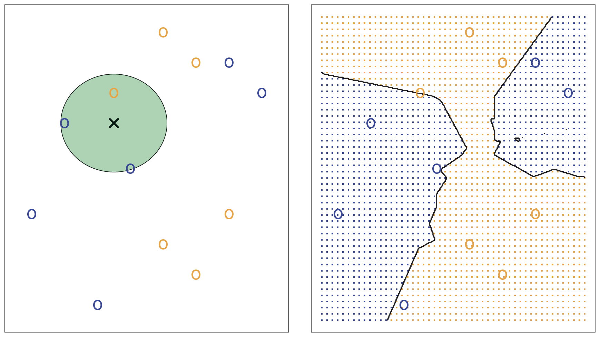
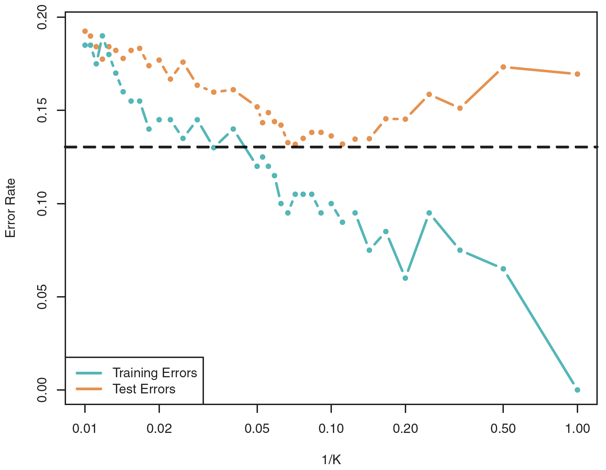

# K-Nearest Neighbors

K-Nearest neighbors (KNN) is a nonparametric method for classification and regression. KNN is a type of *instance-based learning*, the algorithm first learn by heart, then  generalizes based on similarity measurements

## Definition

**Classification**

- KNN estimates the conditional distribution of *Y* given *X*, and assigns *Y* the class with the highest estimated probability
- Given a positive integer *K* and a test observation *x0*, the KNN classifier identifies the *K* closest points to *x0* in the training data *N0*, and then estimates the conditional probability for class *j* as the fraction of points in *N0* whose response values equal *j*
*
 Pr(Y = j | X = x0) = (1/K) x (Sum(I(yi = j))) 
*
- The final classification is assigned based on the class with the highest probability

**Regression**

- KNN estimates the value of an input by taking the average of the values of its *K* nearest neighbors.

**Illustrations**

- Left: the instance to estimate *x* where *K = 3*
- Right: when there are two classes, the boundary where the probability of either class is exactly 50% is called the *KNN decision boundary*

## Parameter selection

- The choice of *K* has a drastic effect of the KNN classifier, which follows the *bias-variance trade-off* rule.
- The model flexibility is a function of *1/K* 
	- A small *K* makes the decision boundary very flexible, indicating a classifier with low bias but high variance. The model is overfitted. 
	- A large *K* makes the decision boudary close to linear, indicating a classifier with high bias but low variance. The model is underfitted.
- The *training error* is a function of *1/K*
	- A small *K* indicates a low-bias classifier, hence a small training error
	- The smallest *testing error*, however, occurs when *K* is neither too small (*K = 1*) or too large (*K = 100*), as demonstrated below

## References
1. [An Introduction to Statistical Learning](http://www-bcf.usc.edu/~gareth/ISL/)
2. [k-nearest neighbors algorithm](https://en.wikipedia.org/wiki/K-nearest_neighbors_algorithm#k-NN_regression)