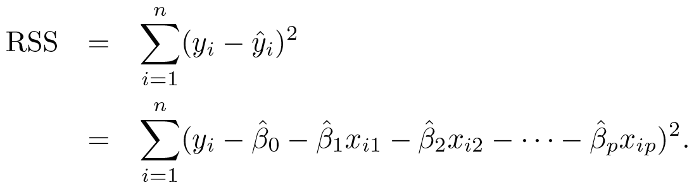
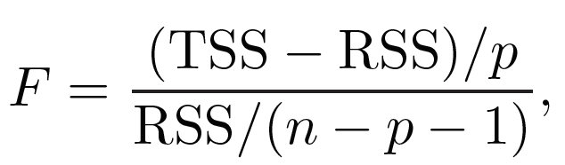
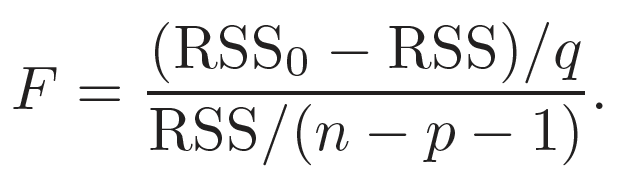
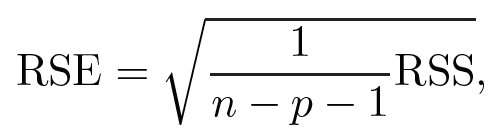

# Multiple Linear Regression 

## Definition

- Multiple linear regression is an extention of simple linear regression, where there are more than one predictor variables *X1, X2, ..., Xp,* to predict a quantitative response *Y*
- The assumption of a linear relationship between *X* and *Y* still holds, and can be described mathematically as
*
 Y = &beta;0 + &beta;1X1 + &beta;2X2 + ... + &beta;pXp + &epsilon; 
*

	- Given *p* distinct predictors, *Xj* represents the *j*th predictor and *&beta;j* quantifies the association between the variable and the response
	- *&beta;j* is the average effect on *Y* of a one unit increase in *Xj*, when all other predictors are held fixed

## Coefficient estimation

- Similar to simple linear regression, the coefficients *&beta;j* are unkonwn, and can be predicted with

*
 y' = &beta;0 + &beta;1x1 + &beta;2x2 + ... + &beta;pxp
*

- The estimation is done via the same *least squares approach* 
	- We choose *&beta;0*, *&beta;1*, ..., *&beta;p* to minimize *residual sum of squares (RSS)*
	- The estimates *&beta;0'*, *&beta;1'*, ..., *&beta;p'* are the multiple least squares regression coefficient estimates, as shown below
	
  

	
	- The slope term is interpreted as the unit change in *y* with a one-unit increase of the coefficient, **holding the rest of the coefficents constant**
- In simple linear regression, only one coefficient is considered for its effect on *y*, while the rest are ignored; in multiple linear regression, only one coefficient is considered for its effect on *y* at a time, while the rest are fixed
- Muliple linear regression can reveal if the seemingly significant correlation of a predictor seen in a simple linear regression still holds true when adjusted for confounders

## Coefficient estimation assessment

- Hypothesis testing can again be used to determine whether there is a significant relationship between the response and the predictors
	- *Null hypothesis H0*: There is no relationship between *X* and *Y* (*&beta;1 = &beta;2 = ... = &beta;p = 0*)
	- *Alternative hypothesis Ha*: There is some relationship between *X* and *Y* (at least one *&beta;j ≠ 0*)
- The *F-statistic* to test if *H0* is correct is computed as 
	
  
 
	
	- *E{RSS / (n - p - 1)} = &sigma;2* when the linear model assumpions are correct
	- *E{(TSS - RSS) / p} = &sigma;2* when *H0* is correct
	- *F ~ 1* when *H0* is true; *F > 1* when *Ha* is true
	- *p-value* associated with the *F-statistics* can be calculated to determine whether to reject *H0*
	- Note that rejecting *H0* only shows that **not all coefficients are the same**, but does not show **which coefficients contribute to *y* more significantly**

- To test only a subset of *q* coefficients and whether they are 0, the hypothesis testing can be set up as
	- *Null hypothesis H0*: All the other coefficients are 0 (*&beta;p-1+1 = &beta;p-q+2 = ... = &beta;p = 0*)
	- This amounts to fitting a second model that uses the all the variables except for the q variables
	- If the *residual sum of squares* for the second model is *RSS0*, the *F-statistics* can be denoted as
	
  
 
	- Consider the situation when *q = 1*, a third model can be built with only the predictor of interest, generating a simple linear regression
	- The square of the *t-statistics* for the third simple linear regression model is the same as the *F-statistics* for the second multilinear regression model

- A couple more points regarding the *t-* and *F-statistics*
	- The *t-statistics* reports the partial effect of a variable on the response when multiple predictors are present
	- Performing multiple simple linear regressions on individual predictors, however, suffer from inflation of *p-value* due to multiple comparisons, while the *F-statistics* prevents this problem
	- In the case when there are more predicotors *p* than samples *n*, there are more *&beta;j* to estimate that the obervations from which to estimate them. *Least squares* cannot be used to fit a multiple linear regression in this situation, and hence the *F-statistics* cannot be calculated 
	- *Forward selection* can be used in the case of large numbers of variables

## Variable selection

If the *F-statistics* show a significant *p-value*, indicating that at least one predictor is related to the response, the next step is to identify the actual predictor(s) associated with the response. 

- The task of determining which predictors are associated with the response is called *variable selection* or *feature selection*
	- The ideal situation is to build all possible models of all combinations of the predictors and assess model quality via (1) *Mallow's Cp*, (2) *Akaike information criterion (AIC)*, (3) *Bayesian information criterion (BIC)*, and (4) *adjusted R2*
	- However, for *p* predictors, there are 2p possible models

- An automated and efficient approach for *feature selection* to choose a smaller set of models to consider is thus required. The three classical approaches are described below
- *Forward selection*
	- The starting model is the *null model*, with only an intercept but no predictors
	- *p* simple linear regressions are then fitted and the variable that results in the lowest *RSS* is added to the model
	- *p - 1* two-variable linear regression are hen fitted with the remaining variables and the variable that results in the lowest *RSS* is added as a second predictor to the model
	- This process is continued until some stopping rule is satisfied
	- A greedy approach and might include variable early that later become redundant 
- *Backward selection*
	- The starting model is one containing all variables
	- The variable with the largest *p-value* is removed, and the model containing *p - 1* variables are fitted 
	- The next variable with the largest *p-value* is removed 
	- This process is repeated until a stopping rule is reached, e.g. when all remaining variables have a *p-value* below a threshold
	- Cannot be used if *p* > *n*, i.e. there are more predictors than observations
- *Mixed selection*
	- A combination of *forward* and *backward selection*
	- The starting model is the *null model*, and similar to *forward selection*, he variables are added one-by-one
	- If at any point, the *p-value* for one of the variables rises above a certain threshold, *backward selection* is implemented and the variable is removed
	- Both processes are continued until all variables in the model have a sufficiently low *p-value*, and all variables outside the model would have a large *p-value* if added to the mdoel
	- Remedies the potential redundant variable problem of *forward selection*

## Model assessment

The most common measurement of model fit is *residual standard error (RSE)* and *R2* 

- In multiple linear regression, *R2* = *Cor(Y, Y')2*
	- The fitted linear model (*Y'*) maximizes the correlation among all possible linear models
	- For *R2* ~ 1, the model explains a large porion of the variance in the response variable
	- *R2* will always increase as more predictors are added to the model, even if the variables are only weakly associated with the response
	- As the model becomes more fitted to the training data with the addition of variables, the *R2* statistic computed on the training data will also increase 

-  The *RSE* is defined as
	
  
 
	
	- Models with more variables can have a higher *RSE* if the decrease in *RSS* is small compared to the increase in *p*

- Graphical summaries can also be useful in visualizing the characteristics of the model fit
	- Synergy or interaction effects of two variables could lead to overestimation when only one variable is high, and underestimation when both variables are high

## Making predictions

- Once a multiple linear regression model is fit, new predictors can be plugged into the model to predict responses
	- The predicted response takes the form of 
*
 Y' = &beta;0' + &beta;1'X1 + ... + &beta;p'Xp 
*

	- This is only an estimate of the true form
*
 f(X) = &beta;0 + &beta;1X1 + ... + &beta;pXp 
*

- *Confidence intervals* and *prediction intervals* can be calculated to assess the accuracy of the prediction *Y'*
	- The inaccuracy of the prediction is related to the *reducible error*, and a *confidence interval* can be calculated to estimate the difference of *Y'* to *f(X)*
	- Even if *f(X)* is known, there is still *irreducible error*, or *random error &epsilon;*, that prevents a perfect prediction of the response. A *prediction interval* can be used to estimate the difference of *Y'* to *Y*
	- The *prediction interval* will always be greater than the *confidence interval* as it contains both the error in the estimate for *f(X)* (*reducible error*) and the uncertainty of how much an individual point will differ from the population regression plane (*irreducible error*)

- In the sales and advertisement example, the 95% confidence and prediction intervals are interpreted as containing the true value of sales for **sales averaged across multiple cities** and **sales for a specific city**, respectively
 
## References

1. [An Introduction to Statistical Learning](http://www-bcf.usc.edu/~gareth/ISL/)
