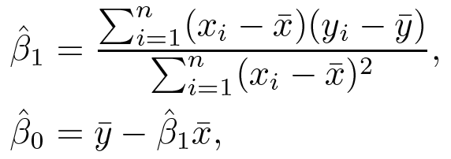

# Simple Linear Regression

## Definition

- Simple linear regression uses a single predictor variable *X* to predict a quantitative resposne *Y* and assumes an approximate linear relationship between *X* and *Y*. 
- This can be described mathematically by *regression Y onto X*, as shown below
*
 Y ≈ &beta;0 + &beta;1X  
*

- The two parameters, *&beta;0* and *&beta;1*, describe the *intercept* and the *slope* of the linear model, respectively
	-  *&beta;0* indicates the expected value of *Y* when *X = 0*
	-  *&beta;1* indicates the average change in *Y* associated with a one-unit increase in *X*
- Since the true values are unknown, the *training data* is used to produce estimates, *&beta;0'* and *&beta;1'*, as shown below
*
 y' = &beta;0' + &beta;1'x  
*

## Coefficient estimation

- The first step of building a simple linear regression model is to use the *training data* to estimate the *coefficients*, or *parameters*, of the model
- The goal of the estimated coefficients is for the predicted value to be as close to the *training data*, such that for *i = 1, ..., n*
*
 yi ≈ &beta;0' + &beta;1'xi  
*
- The most common appoach to measuring *closeness* of the predicted data and *training data* is to *minimize the least squares*
	- The *residual sum of squares (RSS)* is defined as
*
 RSS = e12 + e22 + ... + en2  
RSS = (y1 - &beta;0' - &beta;1'x1)2 + (y2 - &beta;0' - &beta;1'x2)2 + ... + (yn - &beta;0' - &beta;1'xn)2 
*
	- The *least squares* approach chooses &beta;0' and &beta;1' to minimize the *RSS*, i.e. the *least squares coefficient estimates* for simple linear regression is defined as
	
  

	- In other words, *RSS* is a function of &beta;0' and &beta;1'. The values where &beta;0' and &beta;1' can minimize *RSS* is shown above
	- The *least squares regression coefficient estimates*, as shown above, define the *least square line*

- Recall that the true relationship between *X* and *Y* is unknown and there is a mean-zero random error term, &epsilon;, that cannot be reduced
	- Under a linear function, the *population regression line* can be written as
*
 Y = &beta;0 + &beta;1X + &epsilon;  
*
	- The error term describes all variations of *Y* that is not captured by the simple linear model, and is assumed to be independent of *X*

## Coefficient estimation assessment

To assess how close the estimated coefficients *&beta;0'* and *&beta;1'* are to the true value, *standard error*, *confidence interval*, and *hypothesis testing* can be performed

- The *standard error* associated with *&beta;0'* and *&beta;1'* can be computed with the following
	
  

	- *&sigma;2* = Var(&epsilon;), where the errors *&epsilon;i* for each observation are uncorrelated with common vriance *&sigma;2*
	- Note that *SE(&beta;1')* is smaller if *xi* are more spread out, meaning that given a wider number of *xi*, the dynamic range of the linear model is bigger, and therefore leading to a more stable model
- The *95% confidence interval* is defined as a range of values such that with 95% probability, the range wil lcontain the true unknown value of the parameter
	
 *&beta;0' ± qt x SE(&beta;0')*;  *&beta;1' ± qt x SE(&beta;1')*

	- *qt* is the quantile of *(100 - 95) / 2* with a *n - 2 degrees of freedom* under a *t-distribution*

- *Hypothesis testing* can also be performed using the *standard errors* of the estimated coefficients. The most common involves testing the *null hypothesis* against the *alternative hypothesis*
	- *Null hypothesis H0*: There is no relationship between *X* and *Y* (*&beta;1 = 0*)
	- *Alternative hypothesis Ha*: There is some relationship between *X* and *Y* (*&beta;1 ≠ 0*)
	- The *t-statistic* is used to measure the number of standard deviations that *&beta;1'* is away from 0, as denoted by

 *t = (&beta;1' - 0) / SE(&beta;1')* 
 
	- The *p-value*, in which the probability of observing any number equal or more extreme than *t* under the *null hypothesis*, can then be calculated. 
	- A small *p-value* indicates that the probability of observing a more extreme *t* assuming that *&beta;1' = 0* is less likely, and therefore, the *null hypothesis* is rejected
	- This indicates that it is unlikely to observe such a substantial association between the predictor and the response due to chance

- *p-value* can also be explained as:
	- The probability that under the assumption that the null hypothesis is true, the statistical summary would be more extreme than the observed results
	- The probability that the observation of the data and those more extreme happen purely by change 

## Model assessment

Once the *null hypothesis* is rejected, it is then possible to quantify the extent to which the model fits the data. This can be assessed by calculating the *residual standard error (RSE)* and the *R2*

- The *RSE* is an estimate of the standard deviation of *&epsilon;*, and is close to the average amount that the response will deviate from the true regression line, shown as
	
  

	- Even if the model was correct and the true values of the unknown *&beta;0* and *&beta;1* were known, the deviation of the response from the model is described as *RSE*
	- The *RSE* is a measure of the lack of fit of the model to the data. The smaller the *RSE*, the better the model fits the data
	- The *RSE* is measure in the units of *Y*, so the definition of a *good RSE* varies between the questions being asked

- The *R2* measure the proportion of variability in *Y* explained by the model using *X*. It takes the form of
	
 *R2 = (TSS - RSS) / TSS = 1 - (RSS / TSS)* 

	- The *TSS* is the *total sum of squares* that measures the total variance in *Y* before the regression is performed
	- The *RSS* is defined above that measures the variability in *Y* after teh regression is performed
	- *TSS - RSS* measures the variability in *Y* that is explained by the regression model
	- The *R2* takes the form of a proportion, and therefore is always between 0 and 1, and is independent of the scale of *Y*
	- A *R2* close to 1 indicates that a large proportion of the variability in *Y* can be explained by the regression model
	- In a simple linear regression setting, *R2 = r2*, where *r* is the *correlation* of *X* and *Y*

## References

1. [An Introduction to Statistical Learning](http://www-bcf.usc.edu/~gareth/ISL/)
2. [p-value](https://en.wikipedia.org/wiki/P-value)

